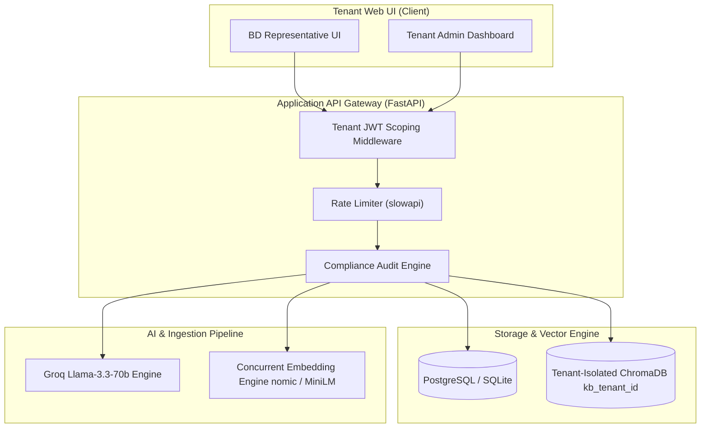
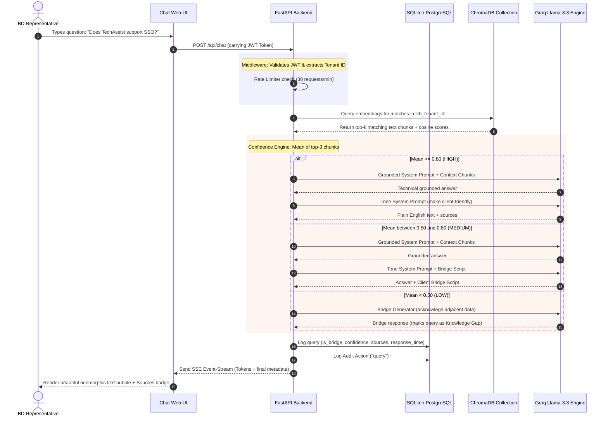

# Technical Proposal: Multi-Tenant SaaS RAG Knowledge Assistant

**Prepared for**: Business Development & Tech Teams  
**System Version**: 2.0.0 (Production-Ready)  

---

## Executive Summary

TechAssist AI is a production-grade, multi-tenant SaaS Knowledge Assistant designed to empower Business Development (BD) representatives. By combining Retrieval-Augmented Generation (RAG) with strict data compliance and tenant isolation, it allows reps to ask complex technical client questions and receive grounded, accurate answers instantly. 

A unique feature is the **Dynamic Knowledge Gap Resolution** loop, which empowers admins to detect unanswered questions, input missing context in real-time, and immediately update the semantic vector space without code redeployment.

---

## Core System Architecture & Design Decisions

The application follows a **shared database, isolated context** SaaS paradigm to ensure scalability, ease of maintenance, and absolute tenant security boundaries.



### 1. Tenant Data Isolation
* **Relational Data**: Implemented via a shared PostgreSQL schema where every table (users, documents, queries, sessions, logs) is explicitly scoped by a `tenant_id` foreign key. All queries are partitioned at the database layer.
* **Vector Data**: Each tenant gets a dedicated, isolated ChromaDB collection named `kb_{tenant_id}`. A tenant's search index is mathematically segregated, making cross-tenant data leaks impossible.

### 2. Ingestion & Chunking Strategy
* **Parsing**: Fast, synchronous document parser for PDF, DOCX, MD, and TXT files, structured to support files up to 10MB.
* **Chunking**: Uses LangChain's `RecursiveCharacterTextSplitter` with `chunk_size=512` characters and `chunk_overlap=50` characters. This boundaries text at natural delimiters (paragraphs, sentences) to preserve context while maintaining semantic coherence.
* **Batch Embedding Optimization**: To prevent bottlenecks when loading large files:
  * **Ollama (`nomic-embed-text`)**: Runs concurrent HTTP requests via a thread pool (`max_workers=10`).
  * **Sentence-Transformers (`all-MiniLM-L6-v2`)**: Fallback provider optimized with batch encoding (`batch_size=64`) to balance GPU/CPU memory and speed.
  * **ChromaDB**: Batch upsert calls are throttled to `100` chunks per request to prevent database locks and memory spikes.

### 3. LLM Selection & Response Grounding
* **Provider**: Groq API using `llama-3.3-70b-versatile` for blazing-fast inference speed (< 1.5 seconds) and top-tier reasoning capabilities.
* **Answer Formatter**:
  * **Grounded Answer**: The LLM compiles answers under strict rules to ONLY reference context documents.
  * **Tone Rewriter**: A secondary prompt rewrites technical jargon into plain, warm, client-friendly business terminology.
  * **Bridge Response Generator**: If context similarity falls below thresholds, a professional script is generated for the rep (e.g. *“What I can confirm is [Fact]. I want to make sure I give you the most accurate answer for [Detail] — I will verify with our tech team by tomorrow morning.”*).

### 4. Admin Feedback & Gap Resolution Loop
Instead of waiting for document updates, admins can act on "Knowledge Gaps" (low-confidence queries or thumbs-down answers) instantly:
1. Admins select an unanswered query in the dashboard and input the correct explanation.
2. The backend appends this QA pair to `resolved_faq.txt` inside the tenant's upload directory.
3. The system automatically parses, chunks, deletes the old version's index from ChromaDB, and re-embeds the updated document.
4. The vector store is instantly updated, and subsequent questions resolve with high confidence.

---

## The Query Lifecycle: Input to Response Flow

This diagram demonstrates the precise step-by-step lifecycle of a client question moving from the BD Representative's input UI to the final formatted response:



---

## Core System Operations

| Component | Technology | Implementation Details |
| :--- | :--- | :--- |
| **Backend Framework** | FastAPI + Uvicorn | Async request handling with Pydantic v2 schemas. |
| **Relational Database** | SQLAlchemy ORM | Driver compatibility for PostgreSQL (Production) & SQLite (Local). |
| **Vector Index** | ChromaDB | Tenant-scoped persistent client indexing. |
| **Rate Limiter** | slowapi | Per-IP token-bucket limiter preventing LLM quota exhaustion. |
| **Audit Logs** | Custom Logger | Logs logins, uploads, deletions, ratings, and compliance exports. |
| **User Interface** | React + Vite | Dark-slate neomorphic dashboard designed for responsiveness. |

---

## Verification & Deployment Strategy

### Automated Verification
* The system is validated using `pytest` and custom end-to-end simulation scripts (e.g. [test_resolve_gap.py](file:///C:/Users/Varun/.gemini/antigravity-ide/brain/34261f32-fa5f-4824-8ca2-6a9c5e69bb78/scratch/test_resolve_gap.py)) which programmatically verify:
  1. Multi-tenant isolation (Tenant A queries cannot search Tenant B's vectors).
  2. Fallback execution path (generating bridge response on ungrounded queries).
  3. Real-time vector updates when resolving knowledge gaps.

### Containerized Deployment
```yaml
# docker-compose.yml configuration
services:
  db:
    image: postgres:16-alpine
    environment: [POSTGRES_DB=techassist]
  chromadb:
    image: chromadb/chroma:latest
  backend:
    build: ./backend
    ports: ["8000:8000"]
    depends_on: [db, chromadb]
  frontend:
    build: ./frontend
    ports: ["80:80"]
```
This Docker layout ensures single-command local setup, testing, and production scaling on any cloud provider.

---

## Conclusion

TechAssist AI transforms how non-technical Business Development representatives handle complex client conversations. By combining Retrieval-Augmented Generation with tenant-isolated vector search and a confidence-driven response engine, the system delivers accurate, grounded answers in real time — eliminating the need for a technical team member in every meeting.

**Key differentiators that set this solution apart:**

1. **Zero Hallucination by Design** — The three-tier confidence engine (HIGH / MEDIUM / LOW) ensures the system never guesses. When knowledge is insufficient, it generates a professional bridge script that preserves client trust rather than risking an incorrect answer.

2. **Self-Healing Knowledge Base** — The Admin Feedback Loop allows knowledge gaps to be resolved in seconds. Admins input the correct answer, and the vector index updates instantly — no redeployment, no developer intervention required.

3. **Enterprise-Grade Multi-Tenancy** — Every tenant operates within a fully isolated data boundary (both relational and vector), ensuring compliance readiness and eliminating cross-tenant data exposure.

4. **Sub-2-Second Response Times** — Groq-powered LLM inference combined with optimized batch embedding and concurrent processing ensures responses arrive fast enough for live client conversations.

The system is production-ready with a working demo, automated test coverage, and a containerized deployment strategy. It can be deployed on any cloud infrastructure and scaled horizontally as the number of tenants grows — making it a future-proof investment for organizations looking to empower their client-facing teams with AI-driven technical knowledge.
